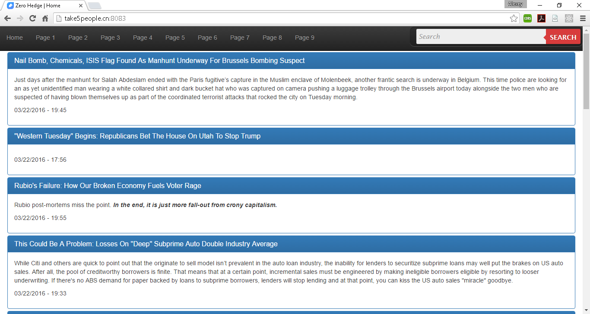
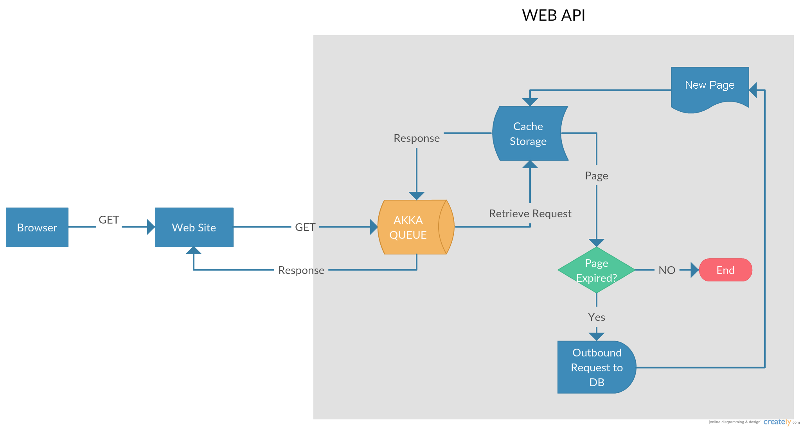

- title : Zero Hedge
- description : Most Valuable Financial Stories
- author : Alexey Zorchenkov
- theme : night
- transition : default

***

### Zero Hedge

- Zero Hedge is a mobile WEB site and REST API from [Zero Hedge web site](http://www.zerohedge.com)
- Utilizes [WebSharper](http://www.websharper.com/) and [AKKA](http://getakka.net/)
- Get it from [GitHub](https://github.com/zuoqin/ZeroHedgeWS) or [open the link](http://www.take5people.cn:8083/)

***

### Reactive Manifesto

***

### WebSharper

- More productive with less code
- A fundamentally different web framework for developing functional and reactive .NET applications
- Markup-driven, strongly-typed reactive applications in minutes

***

### AKKA

- Scalable, distributed real-time transaction processing
- Fault Tolerance
- Location Transparency
- Persistence

***

### Heroku

- Heroku is a platform as a service (PaaS) 

---
- id : Heroku-1

#### Cloud

- enables developers to build and run applications entirely in the cloud
- it’s the best platform for building with modern architectures, innovating quickly, and scaling precisely to meet demand

---

- id : Heroku-2

#### Focus

- Heroku handles the hard stuff — patching and upgrading, 24/7 ops and security, build systems, failovers, and more — so your developers can stay focussed on building great apps

---

- id : Heroku-3

#### Ecosystem

- Powerful platform, unparalleled ecosystem
- it’s the best platform for building with modern architectures, innovating quickly, and scaling precisely to meet demand

---

- id : Heroku-4

#### Applications

- Today every company needs apps to engage their customers and run their businesses. Step up your ability to build, manage, and deploy great apps at scale with Heroku.

---

***

### System Workflow

***

### The Reality of a Developer's Life 

**When I show my boss that I've fixed a bug:**
  

  
**When your regular expression returns what you expect:**
  

  
*from [The Reality of a Developer's Life - in GIFs, Of Course](http://server.dzone.com/articles/reality-developers-life-gifs)*

